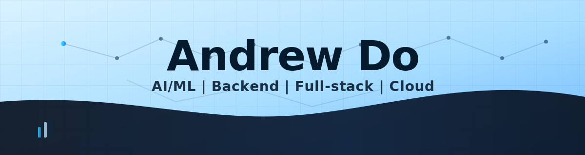
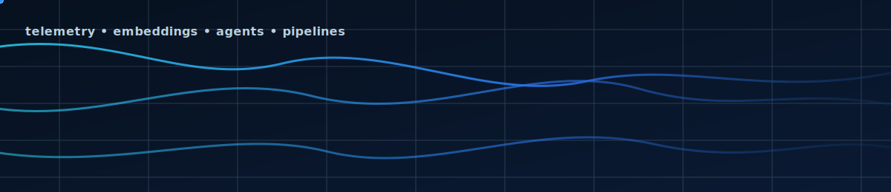

<!-- =========================
Modern GitHub Profile README
Repo name should match your username: androodo
========================== -->

<!-- Custom banner (light blue + modern + subtle AI/data vibe) -->

 

<!-- Typing animation (modern font) -->

 

<!-- Social badges -->

  

<!-- Animated data/AI hero (SVG animation, no GIF needed) -->

---

## 👋 About me
I’m Andrew — a **Computer Science** student at **UC Riverside** (Accelerated **B.S. + M.S.**, **Jun 2027**) building:
- **Cloud-native systems** (APIs, CI/CD, observability, distributed services)
- **LLM/ML products** (agents, embeddings, eval harnesses, guardrails, anomaly detection)
- **Full-stack apps** (React/TS + modern backend + Postgres + AWS)

---

## 🧰 Tech stack

  

---

## 📊 GitHub activity

  
  

---

  

